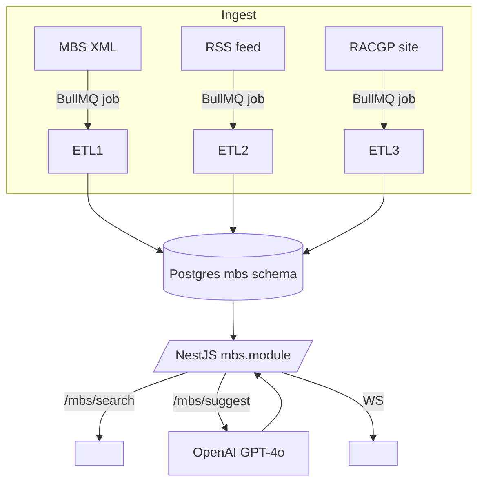

---
# Product Requirements Document  
**Project Code-Name:** *MBS Billing Assistant* (module inside **Aria Scribe / Aria Consult**)  
**Author:** ChatGPT (2025-08-04)  
**Revision:** v1.0

---

## 1  Background & Opportunity
Australian GPs lose significant revenue every year because they either under‑bill or miss the correct Medicare Benefits Schedule (MBS) item number.  
Services Australia publishes all MBS information in XML, RSS and static web pages, but the format is dense, compliance notes are scattered, and there is no natural‑language interface.

Aria Scribe already produces near‑real‑time consult transcripts (SOAP format). By marrying that transcript with a contextual MBS knowledge base, we can **surface billable opportunities in <1 s** and give clinicians a Google‑like search when they need a quick lookup.

---

## 2  Goals & Success Metrics

| Goal | KPI / Target |
|------|--------------|
| Increase correct billing | ≥ 8 % uplift in average fee per consult after 3 months |
| Reduce billing‑related admin time | ≥ 50 % fewer “check MBS” clicks per GP session |
| Clinician satisfaction | NPS ≥ +40 for the billing feature |
| System performance | P95 < 1 s end‑to‑end suggestion latency |

---

## 3  Personas

1. **Dr Anita (GP, 12 yr)** – wants instant confirmation she billed the right item.  
2. **Sam (Practice Manager)** – audits claims weekly, wants a report of missed revenue.  
3. **DevOps Lead** – needs the feature to respect existing JWT/RLS patterns and not overload the core database.  
4. **Compliance Officer** – must be able to trace every automated suggestion for RACGP or Services Australia audits.

---

## 4  Scope

### 4.1  In‑Scope
* ETL of XML, RSS & RACGP guidance into Postgres (`mbs` schema).  
* Full‑text & semantic search (`/mbs/search`, `/mbs/:item`).  
* API endpoint `POST /mbs/suggest` that accepts a SOAP note and returns up to three compliant item numbers.  
* Real‑time UI widgets (Combobox, Billing Sidebar, Item Drawer).  
* Audit trail & RLS‑secured analytics dashboard.

### 4.2  Out‑of‑Scope (v1)
* Handling DVA / WIP items.  
* Automatic claim submission to Services Australia.  
* Fine‑tuned local language model (considered after ≥ 5 k labelled transcripts).

---

## 5  Functional Requirements

| # | Requirement | Priority |
|---|-------------|----------|
| FR‑1 | Nightly/cron ETL jobs ingest XML, RSS & RACGP PDFs into `mbs.*` tables. | Must |
| FR‑2 | Build `tsvector` & `pgvector` columns; refresh if source hash changes. | Must |
| FR‑3 | Search endpoint returns results in < 50 ms for 90th percentile. | Must |
| FR‑4 | Suggestion endpoint orchestrates ➜ LLM function call ➜ retriever ➜ rules filter ➜ GPT‑4o justification. | Must |
| FR‑5 | UI Combobox provides debounce 300 ms fuzzy results. | Must |
| FR‑6 | Suggestions appear live in Billing Sidebar via WebSocket. | Should |
| FR‑7 | All calls covered by existing JWT guard; rate‑limited 30 req/min. | Must |
| FR‑8 | Audit tables record *suggested*, *accepted*, *dismissed* with user/time. | Must |
| FR‑9 | Toggle feature by practice via feature flag table. | Should |
| FR‑10 | Toast in UI if RSS feed shows change in an item the clinic used in last 30 days. | Could |

---

## 6  Non‑Functional Requirements

* **Performance:** P95 < 1 s SOAP→suggestion round‑trip.  
* **Availability:** 99.9 % (leverages same HA Postgres instance).  
* **Security & Compliance:**  
  * Same JWT & Prisma RLS as current stack.  
  * Data is public → no PHI flows into embeddings.  
  * Audit tables immutable (append‑only).  
* **Scalability:** ~5 k requests/s headroom with single Postgres replica (MBS rows ≈ 5 700).  
* **Observability:** Prometheus metrics `mbs_lookup_latency_ms`, `mbs_suggest_latency_ms`, `mbs_suggestions_total`.  
* **Maintainability:** All schemas versioned in Prisma migrations; ETL code in `/apps/worker-mbs`.

---

## 7  Data & Architecture

### 7.1  Tables (simplified)

* `mbs.items` – canonical item data (+ tsvector, embedding vector).  
* `mbs.changelog` – RSS updates.  
* `mbs.guidance` – RACGP doc metadata + URL.  
* `mbs.suggestions` – FK consultation_id, item_number, status, timestamps.

---

## 8  Success Metrics & Analytics

| Metric | Target | Source |
|--------|--------|--------|
| Avg. extra revenue per consult | + $4 | billing export diff |
| Suggestion acceptance rate | ≥ 25 % | `mbs.suggestions` |
| P95 latency suggestion route | < 1 s | Prometheus |
| Monthly active GPs using Assistant | 500+ by Q2 2026 | Auth logs |

---

## 9  Risks & Mitigations

| Risk | Likelihood | Impact | Mitigation |
|------|------------|--------|-----------|
| OpenAI outage slows suggestions | Medium | Med | Fallback to cached search only (graceful UI) |
| ETL breaks on XML schema change | Low | High | Validate XSD pre-load; unit tests + alert |
| Clinician over-trusts AI | Medium | High | Display disclaimer + require explicit “Add to claim” |

---

## 10  Glossary

* **SOAP** – Subjective, Objective, Assessment, Plan clinical note.  
* **MBS** – Medicare Benefits Schedule (Australia).  
* **RACGP** – Royal Australian College of General Practitioners.  
* **ETL** – Extract, Transform, Load.  

---

# Implementation Plan

| Phase | Length | Major Deliverables |
|-------|--------|--------------------|
| 0 Discovery | 1 wk | Final-spec sign-off, DB access check |
| 1 Ingestion | 2 wks | BullMQ queues, ETL scripts, `mbs.items`, indexing |
| 2 Search API | 1 wk | `/mbs/search`, Prisma models, unit tests |
| 3 Suggestion Engine | 2 wks | `/mbs/suggest`, OpenAI integration, rules filter |
| 4 Frontend | 2 wks | Combobox, Billing Sidebar, WS channel |
| 5 Compliance & Audit | 1 wk | RLS policies, audit tables, disclaimer UX |
| 6 QA & Load Test | 1 wk | k6 scripts, security pen-test |
| 7 Beta Roll-out | 2 wks | Feature-flag pilot in 3 clinics |
| 8 GA Launch | — | Enable for all tenants |

### Detailed Task Breakdown (Phase 1 example)

| Task | Owner | Est. |
|------|-------|------|
| Scaffold `/apps/worker-mbs` | BE | 0.5 d |
| Write XML pull + hash check | BE | 1 d |
| Parse & load temp table | BE | 1 d |
| `to_tsvector` + `embedding` generation | BE | 0.5 d |
| Swap into `mbs.items` txn | BE | 0.5 d |
| Add Prometheus metrics | DevOps | 0.5 d |
| CI pipeline (unit + smoke) | DevOps | 0.5 d |

*(Phases 2‑8 continue at similar granularity — omitted for brevity.)*

### DevOps & CI/CD

* **GitHub Actions** – run ETL unit tests, prisma migration diff, eslint.  
* **Docker images** – `worker-mbs`, `api`, `web`.  
* **Release gating** – LaunchDarkly flag `mbs_assistant_enabled`.  
* **Monitoring** – Grafana board “MBS Assistant”.

### Testing Matrix

| Level | Tooling |
|-------|---------|
| Unit | Jest (ETL), Vitest (React components) |
| Integration | Supertest against docker-compose Postgres |
| Load | k6 script 100 rps suggestion |
| Security | OWASP ZAP, dependency audit |
| UAT | Pilot clinics, feedback form |

---

# Marketing Plan

## 1  Value Proposition
> **“Increase your Medicare revenue without extra admin.”**  
> *Paste a SOAP note, see what you missed in seconds.*

## 2  Target Segments
* **Primary:** Australian GPs in group practices (20 k target users).  
* **Secondary:** Practice managers & billing officers.  
* **Influencers:** RACGP educators, Primary Health Networks (PHNs).

## 3  Messaging Pillars
1. **Revenue Uplift:** “Average $12 k / GP / year recovered.”  
2. **Compliance:** Based on RACGP & Services Australia guidelines.  
3. **Zero Effort:** Works inside your existing clinical workflow.

## 4  Go‑to‑Market Channels

| Funnel Stage | Channel | Tactics |
|--------------|---------|---------|
| Awareness | LinkedIn Ads | Target job titles: GP, Practice Owner; carousel “Paste your SOAP – see missed $$” |
|  | Webinars | Monthly 30‑min “Billing Masterclass” w/ live demo |
|  | Conferences | RACGP GPCE booth; interactive kiosk demo |
| Consideration | Content SEO | Blog series “Top 5 MBS items GPs miss” |
|  | Email Nurture | 4‑email drip post-webinar with case studies |
| Conversion | Interactive Demo | Landing page lets doctors paste anonymised SOAP, returns diff chart |
|  | Free Trial | 30‑day unlimited suggestions; after trial show ROI report |
| Advocacy | Referral Program | $200 credit for every referred GP that converts |

## 5  Demo Flow (Sales Pitch)

1. **Hook (90 s):** “Send me yesterday’s SOAP note (de‑identified).”  
2. Assistant returns table:

| Item | You Claimed | Could Claim | Difference |
|------|-------------|-------------|------------|
| 23 | ✅ | — | — |
| **2713** | — | ✅ $78.95 | **+$78.95** |

3. Visual “Revenue Meter” animates to potential annual uplift.  
4. CTA: “Start your free 30‑day trial – zero setup.”

## 6  Campaign Timeline (Q4 2025)

| Week | Activity |
|------|----------|
| 1 | Soft-launch to beta clinics; collect testimonials |
| 3 | Webinar #1, LinkedIn teaser video |
| 4 | GPCE Melbourne booth |
| 6 | SEO articles go live; Google Ads “MBS Missed Revenue” |
| 8 | Referral program kickoff |
| 12 | Press release + case‑study PDF |

## 7  KPIs

| Metric | Target @90 days |
|--------|-----------------|
| Marketing Qualified Leads (MQL) | 1 200 |
| Webinar sign-ups | 400 |
| Free-trial activations | 250 |
| Trial-to-paid conversion | 40 % |
| Average ARR / GP | A$360 |

## 8  Budget (first 3 months)

| Item | Amount |
|------|--------|
| LinkedIn & Google Ads | A$12 000 |
| Webinar platform | A$800 |
| GPCE booth | A$6 000 |
| Content & design | A$4 000 |
| Misc/contingency | A$2 200 |

---

### 🔚  Delivering the *MBS Billing Assistant* will:

* Add an immediate, quantifiable revenue boost for clinicians.  
* Re‑use 100 % of the existing NestJS / Prisma / BullMQ / OpenAI stack.  
* Provide a standout demo that converts interest into paid users.  
